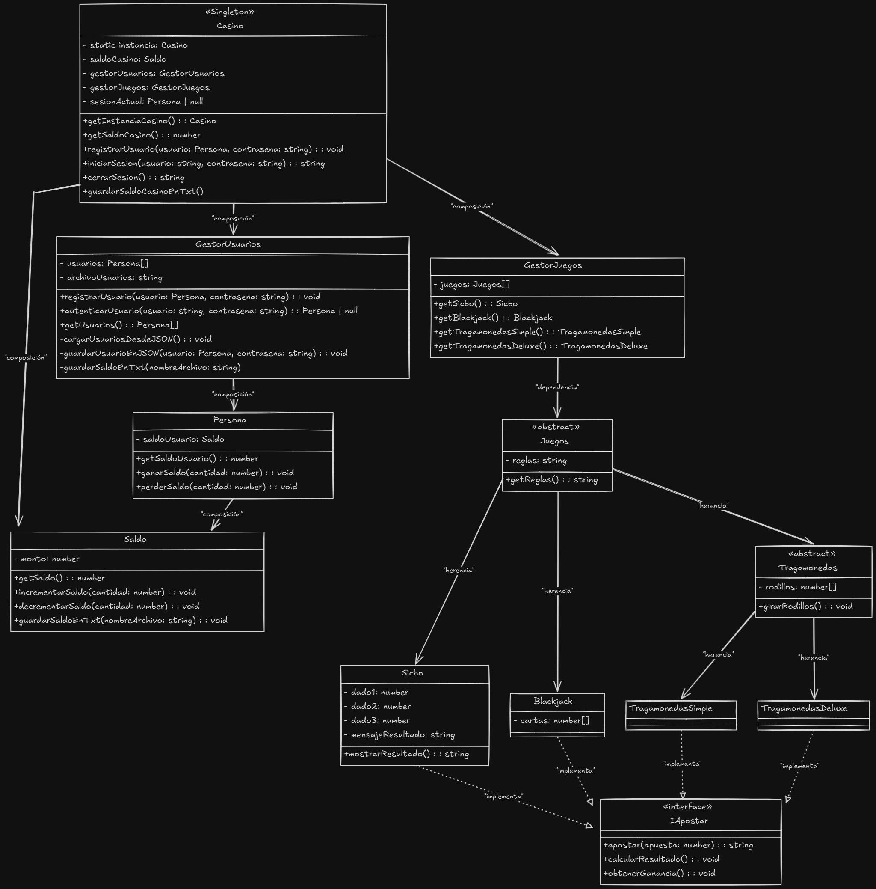

# TP Final - Casino

Este proyecto es un sistema de casino implementado en TypeScript. Está estructurado en distintas carpetas que agrupan la lógica del juego, las interfaces, los modelos y los datos necesarios para su funcionamiento. Este README detalla la estructura del proyecto y los pasos necesarios para configurar el entorno de desarrollo.

## Estructura del proyecto

```plaintext
.
├── Data/                   # Carpeta que contiene los archivos de datos como el saldo y usuarios registrados
│   ├── saldo.txt           # Archivo de texto donde se guarda el saldo del casino
│   └── usuarios.json       # Archivo JSON donde se guardan los datos de los usuarios
│
├── Docs/                   # Carpeta para documentación del proyecto
│   └── UML.png             # Diagrama UML que representa el diseño del proyecto
│
├── Interfaces/             # Carpeta con las interfaces del proyecto
│   └── IApostar.ts         # Interfaz para juegos de apuesta
│
├── src/                    # Carpeta principal del código fuente
│   ├── Models/             # Contiene las clases principales y modelos del sistema
│   │   ├── Casino.ts       # Clase principal que gestiona el casino
│   │   ├── GestorJuegos.ts # Clase para gestionar los juegos
│   │   ├── GestorUsuarios.ts # Clase para gestionar los usuarios
│   │   ├── Persona.ts      # Clase para definir a los usuarios del casino
│   │   └── Saldo.ts        # Clase para gestionar el saldo
│   │
│   ├── Juegos/             # Contiene las clases específicas de los juegos
│   │   ├── Blackjack.ts    # Implementación del juego Blackjack
│   │   ├── Sicbo.ts        # Implementación del juego Sicbo
│   │   ├── Tragamonedas.ts # Clase abstracta para los juegos de tragamonedas
│   │   ├── TragamonedasDeluxe.ts # Implementación del juego Tragamonedas Deluxe
│   │   └── TragamonedasSimple.ts # Implementación del juego Tragamonedas Simple
│
├── README.md               # Archivo con la descripción del proyecto y las instrucciones de uso
├── index.ts                # Archivo principal para ejecutar el proyecto
├── menu.ts                 # Menú de opciones para interactuar con el casino desde la consola
│
├── package.json            # Configuración de npm, incluyendo dependencias del proyecto
└── .gitignore              # Archivos y carpetas que no se deben incluir en el repositorio

## Diagrama UML



